# Complete Documentation - MCP Outlook

Complete technical documentation for MCP Outlook v1.2.3

## Table of Contents

- [Architecture](#architecture)
- [Installation](#installation)
- [Configuration](#configuration)
- [Email Tools](#email-tools)
- [Calendar Tools](#calendar-tools)
- [Contact Tools](#contact-tools)
- [Folder Tools](#folder-tools)
- [Out-of-Office Tools](#out-of-office-tools)
- [MCP Resources](#mcp-resources)
- [Error Handling](#error-handling)
- [Performance](#performance)
- [Security](#security)
- [Limitations](#limitations)

---

## Architecture

### Overview

MCP Outlook is an MCP (Model Context Protocol) server that allows AI assistants to interact with Microsoft Outlook via the Windows COM API.

```mermaid
graph TD
    A("🤖 AI Assistant<br/>Cursor/Claude") -->|"⚡ MCP Protocol"| B("🔧 MCP Outlook<br/>Server")
    B -->|"🔌 COM Automation"| C("✉️ Microsoft<br/>Outlook")
    
    style A fill:#E3F2FD,stroke:#90CAF9,stroke-width:2px,color:#1565C0
    style B fill:#E8F5E9,stroke:#81C784,stroke-width:2px,color:#2E7D32
    style C fill:#FFF3E0,stroke:#FFB74D,stroke-width:2px,color:#E65100
```



### Technologies

- **Python 3.10+** - Base language
- **FastMCP** - MCP Framework
- **pywin32** - COM automation
- **dateutil** - Flexible date parsing

### Project Structure

```
mcp-outlook/
├── src/
│   ├── __init__.py
│   └── outlook_mcp.py      # Main MCP server (1840 lines)
├── tests/
│   ├── __init__.py
│   ├── test_connection.py
│   ├── test_outlook_mcp.py
│   ├── test_advanced.py
│   └── test_tools.py
├── pyproject.toml          # Project configuration
├── requirements.txt        # Dependencies
├── README.md              # User documentation
├── DOCUMENTATION.md       # This file
├── CONTRIBUTING.md        # Contribution guide
├── CHANGELOG.md           # Version history
├── LICENSE                # MIT License
├── QUICK_START.md         # Quick start guide
└── EXAMPLES.md            # Usage examples
```

---

## Installation

### Prerequisites

#### Operating System
- **Windows 10/11** (required for COM automation)
- Not possible on Linux/macOS (Windows COM API only)

#### Software
- **Microsoft Outlook** (version 2010+)
  - Installed and configured
  - At least one email account configured
  - Outlook must be running

#### Python
- **Python 3.10 or higher**
- Check: `python --version`
- Download: https://www.python.org/downloads/

### Installing Dependencies

```bash
# Clone/download the project
git clone https://github.com/YOUR_USERNAME/mcp-outlook.git
cd mcp-outlook

# Install dependencies
pip install -r requirements.txt

# OR install in development mode
pip install -e .
```

### Python Dependencies

The `requirements.txt` file contains:

```txt
fastmcp>=0.1.0
pywin32>=306
python-dateutil>=2.8.2
```

#### Dependency Details

- **fastmcp** - MCP framework for creating servers
- **pywin32** - Access to Windows COM APIs
- **python-dateutil** - Flexible date parsing

### Post-Installation pywin32

If you encounter errors with `win32com`, run:

```bash
python Scripts/pywin32_postinstall.py -install
```

### Installation Verification

```bash
python tests/test_connection.py
```

Expected output:
```
✓ PASS: Imports
✓ PASS: Outlook Connection
✓ PASS: Server File
```

---

## Configuration

### MCP Configuration

#### For Cursor

File: `~/.cursor/mcp.json` or workspace settings

```json
{
  "mcpServers": {
    "outlook": {
      "command": "python",
      "args": [
        "C:/Users/YOUR_USERNAME/path/to/mcp-outlook/src/outlook_mcp.py"
      ],
      "env": {}
    }
  }
}
```

#### For Claude Desktop

File: `%APPDATA%/Claude/claude_desktop_config.json`

```json
{
  "mcpServers": {
    "outlook": {
      "command": "python",
      "args": [
        "C:/Users/YOUR_USERNAME/path/to/mcp-outlook/src/outlook_mcp.py"
      ]
    }
  }
}
```

### Configuration Variables

In `src/outlook_mcp.py`:

```python
# Default limits
DEFAULT_EMAIL_LIMIT = 5        # Default email limit returned
MAX_EMAIL_LIMIT = 50           # Maximum allowed limit
DEFAULT_CONTACT_LIMIT = 50     # Default contact limit
MAX_CONTACT_LIMIT = 200        # Maximum contact limit
EMAIL_BODY_PREVIEW_LENGTH = 500  # Body preview length
DEFAULT_DAYS_BACK = 2          # Search last 2 days by default

# Excluded stores (team/shared mailboxes)
EXCLUDED_STORES = [
    # Example: "Team Mailbox Name",
]
```

### Logging

Logging is configured in silent mode by default:

```python
# CRITICAL level only (no spam)
logging.basicConfig(
    level=logging.CRITICAL,
    format='%(message)s',
    handlers=[logging.NullHandler()]
)
```

To enable debugging, modify in `outlook_mcp.py`:

```python
logger.setLevel(logging.DEBUG)  # Instead of CRITICAL
```

---

## Email Tools

### `get_inbox_emails`

Retrieves emails from the inbox.

#### Parameters

| Parameter | Type | Default | Description |
|-----------|------|---------|-------------|
| `limit` | int | 5 | Max number of emails to return |
| `unread_only` | bool | False | Return only unread emails |

#### Return

```json
{
  "success": true,
  "count": 3,
  "emails": [
    {
      "subject": "Q1 Budget Review",
      "sender": "Jane Smith",
      "sender_email": "jane.smith@company.com",
      "recipients": "team@company.com",
      "cc": "",
      "bcc": "",
      "received_time": "2025-12-17 09:30:00+00:00",
      "sent_on": "2025-12-17 09:29:45+00:00",
      "body": "Hi team, please review...",
      "body_length": 1245,
      "has_attachments": true,
      "attachment_count": 2,
      "attachments": [
        {
          "filename": "report.pdf",
          "size": 245678,
          "type": 1
        }
      ],
      "importance": 1,
      "unread": true,
      "categories": "",
      "entry_id": "00000000..."
    }
  ]
}
```

#### Example

```python
# Last 10 unread emails
get_inbox_emails(limit=10, unread_only=True)

# Last 5 emails (read and unread)
get_inbox_emails(limit=5)
```

#### Notes

- Limited to `MAX_EMAIL_LIMIT` (50) to avoid Outlook freezes
- Body is truncated to `EMAIL_BODY_PREVIEW_LENGTH` (500 characters)
- Emails are sorted by received date descending

---

### `get_sent_emails`

Retrieves sent emails.

#### Parameters

| Parameter | Type | Default | Description |
|-----------|------|---------|-------------|
| `limit` | int | 5 | Max number of emails to return |

#### Return

Same format as `get_inbox_emails`.

#### Example

```python
get_sent_emails(limit=10)
```

---

### `search_emails`

Searches emails in standard folders.

#### Parameters

| Parameter | Type | Default | Description |
|-----------|------|---------|-------------|
| `query` | str | *required* | Search term |
| `folder` | str | "inbox" | Folder ("inbox", "sent", "drafts", "deleted", "all") |
| `limit` | int | 20 | Max number of results |

#### Return

```json
{
  "success": true,
  "query": "project alpha",
  "count": 5,
  "emails": [...]
}
```

#### Example

```python
# Search in inbox
search_emails(query="meeting", folder="inbox", limit=10)

# Search everywhere
search_emails(query="budget", folder="all", limit=50)
```

#### Notes

- Searches in subject, body, and sender
- Uses Outlook's DASL syntax for efficiency
- folder="all" searches in inbox, sent, and drafts

---

### `send_email`

Sends an email via Outlook.

#### Parameters

| Parameter | Type | Default | Description |
|-----------|------|---------|-------------|
| `to` | str | *required* | Recipient(s), separated by ";" |
| `subject` | str | *required* | Email subject |
| `body` | str | *required* | Content (plain text) |
| `cc` | str | None | CC recipients |
| `bcc` | str | None | BCC recipients |
| `importance` | str | "normal" | "low", "normal" or "high" |
| `html_body` | str | None | HTML content (takes precedence over body) |
| `signature_name` | str | None | Outlook signature name |

#### Return

```json
{
  "success": true,
  "message": "Email sent to colleague@company.com"
}
```

#### Examples

```python
# Simple email
send_email(
    to="colleague@company.com",
    subject="Meeting Follow-up",
    body="Thanks for the meeting today.",
    importance="normal"
)

# Email with CC and high importance
send_email(
    to="team@company.com",
    subject="Urgent: Server Down",
    body="The production server is down.",
    cc="manager@company.com",
    importance="high"
)

# HTML email with signature
send_email(
    to="client@example.com",
    subject="Project Update",
    html_body="<h1>Update</h1><p>The project is on track.</p>",
    signature_name="VP DXT"
)
```

#### Notes on Signatures

- If `signature_name` is provided, Outlook automatically adds the signature
- Signature is inserted via `Display(False)` to preserve images
- Outlook adds ~2 blank lines before signature (native behavior)
- Signatures are searched in `%APPDATA%\Microsoft\Signatures`

---

### `create_draft_email`

Creates a draft email without sending.

#### Parameters

Same as `send_email` (except no `importance`).

#### Return

```json
{
  "success": true,
  "message": "Draft email created"
}
```

#### Example

```python
create_draft_email(
    to="team@company.com",
    subject="Weekly Report",
    body="Please review before sending.",
    cc="manager@company.com",
    signature_name="VP DXT"
)
```

#### Notes

- Draft is saved in the Drafts folder
- Can be modified and sent manually from Outlook

---

### `get_email_attachments`

Lists attachments of an email.

#### Parameters

| Parameter | Type | Default | Description |
|-----------|------|---------|-------------|
| `entry_id` | str | *required* | Email's EntryID |

#### Return

```json
{
  "success": true,
  "count": 2,
  "attachments": [
    {
      "filename": "report.pdf",
      "size": 245678,
      "type": 1,
      "index": 1
    },
    {
      "filename": "data.xlsx",
      "size": 98234,
      "type": 1,
      "index": 2
    }
  ]
}
```

#### Attachment Types

- `type: 1` - Standard file
- `type: 5` - Embedded Outlook item
- `type: 6` - OLE object

#### Example

```python
# Get entry_id from get_inbox_emails
emails = get_inbox_emails(limit=1)
entry_id = emails["emails"][0]["entry_id"]

# List attachments
attachments = get_email_attachments(entry_id)
```

---

### `download_email_attachment`

Downloads an attachment to disk.

#### Parameters

| Parameter | Type | Default | Description |
|-----------|------|---------|-------------|
| `entry_id` | str | *required* | Email's EntryID |
| `attachment_index` | int | *required* | Attachment index (1-based) |
| `save_path` | str | *required* | Full save path |

#### Return

```json
{
  "success": true,
  "message": "Attachment 'report.pdf' downloaded successfully",
  "saved_path": "C:/Downloads/report.pdf",
  "filename": "report.pdf",
  "size": 245678
}
```

#### Example

```python
download_email_attachment(
    entry_id="00000000...",
    attachment_index=1,
    save_path="C:/Users/user/Downloads/report.pdf"
)
```

#### Notes

- Parent directories are created automatically
- Existing files are overwritten without confirmation
- Index starts at 1 (not 0)

---

### `send_email_with_attachments`

Sends an email with attachments.

#### Parameters

Parameters from `send_email` + :

| Parameter | Type | Default | Description |
|-----------|------|---------|-------------|
| `attachments` | str | *required* | File path(s), separated by ";" |

#### Return

```json
{
  "success": true,
  "message": "Email sent to colleague@company.com",
  "attachments_added": 2
}
```

#### Example

```python
send_email_with_attachments(
    to="colleague@company.com",
    subject="Monthly Report",
    body="Please find attached the report and summary.",
    attachments="C:/Users/user/report.pdf; C:/Users/user/summary.xlsx",
    signature_name="VP DXT"
)
```

#### Notes

- All files must exist
- Absolute paths recommended
- Large files can slow sending

---

### `learn_user_email_preferences`

Automatically learns user's email formatting preferences by analyzing recent sent emails.

This tool provides intelligent detection of your default email formatting (font family, color, and size) by analyzing the HTML structure of your recent sent emails. It's designed to help AI assistants format emails consistently with your personal style.

#### Parameters

- `sample_size` (int, optional): Number of recent sent emails to analyze
  - Default: 3
  - Range: 1-10
  - Higher values provide more accurate detection but take longer

#### Return

```json
{
  "success": true,
  "preferences": {
    "font_family": "InspireTWDC",
    "font_color": "#004080",
    "font_size": "12.0pt",
    "confidence": 0.93
  },
  "analyzed_emails": 3,
  "detection_details": {
    "fonts_found": 3,
    "colors_found": 1,
    "sizes_found": 1
  }
}
```

#### How It Works

1. **Retrieves** the specified number of recent sent emails
2. **Extracts** the main body content (excludes signature)
3. **Analyzes** HTML and CSS formatting:
   - Font family (prioritizes custom fonts like InspireTWDC)
   - Font color (hex format like #004080)
   - Font size (detects from CSS MsoNormal class and inline styles)
4. **Weights** CSS-defined styles more heavily (they represent defaults)
5. **Calculates** confidence based on formatting consistency

#### Smart Detection Features

- **Signature Exclusion**: Automatically detects and excludes signature formatting (which may differ from body formatting)
- **CSS-Aware**: Prioritizes Outlook's `p.MsoNormal` CSS class (your default paragraph style)
- **Weighted Detection**: CSS-defined font sizes are weighted 5x to ensure default formatting is detected
- **Font Filtering**: Ignores generic fonts (Arial, Calibri) to find your custom font
- **Confidence Score**: 0.0-1.0 score indicating how consistent your formatting is

#### Example

```python
# Analyze last 3 emails
learn_user_email_preferences(sample_size=3)

# Analyze more emails for better accuracy
learn_user_email_preferences(sample_size=5)
```

#### Use Cases

- **Automated Email Formatting**: Use detected preferences to format AI-generated emails
- **Style Consistency**: Ensure all automated emails match your personal style
- **Template Creation**: Create email templates with your exact formatting
- **Preference Discovery**: Understand your own email formatting habits

#### Notes

- Requires at least 1 sent email with HTML formatting
- Works best with consistent email formatting
- Analyzes only your own email body (not quoted replies)
- Higher confidence (>0.8) indicates very consistent formatting
- If confidence is low (<0.5), consider manually specifying preferences

---

## Calendar Tools

### `get_calendar_events`

Retrieves calendar events.

#### Parameters

| Parameter | Type | Default | Description |
|-----------|------|---------|-------------|
| `days_ahead` | int | 7 | Number of days ahead |
| `include_past` | bool | False | Include past events from today |

#### Return

```json
{
  "success": true,
  "count": 3,
  "events": [
    {
      "subject": "Team Standup",
      "start": "2025-12-17 09:00:00",
      "end": "2025-12-17 09:30:00",
      "location": "Conference Room A",
      "organizer": "manager@company.com",
      "required_attendees": "team@company.com",
      "optional_attendees": "",
      "body": "Daily standup meeting",
      "is_all_day_event": false,
      "reminder_set": true,
      "reminder_minutes": 15,
      "categories": "",
      "busy_status": 2
    }
  ]
}
```

#### Busy Status

- `0` - Free
- `1` - Tentative
- `2` - Busy
- `3` - Out of Office

#### Example

```python
# Events for next 7 days
get_calendar_events(days_ahead=7)

# Events for today (including past)
get_calendar_events(days_ahead=0, include_past=True)
```

---

### `create_calendar_event`

Creates a new calendar event.

#### Parameters

| Parameter | Type | Default | Description |
|-----------|------|---------|-------------|
| `subject` | str | *required* | Event title |
| `start_time` | str | *required* | Start date/time |
| `end_time` | str | *required* | End date/time |
| `location` | str | None | Location |
| `body` | str | None | Description |
| `required_attendees` | str | None | Required attendees, separated by ";" |
| `optional_attendees` | str | None | Optional attendees |
| `reminder_minutes` | int | 15 | Minutes before reminder |
| `is_all_day` | bool | False | All-day event |

#### Supported Date Formats

- ISO: `"2025-12-20 14:00"`
- Natural language: `"tomorrow 2pm"`, `"next Monday at 9am"`

#### Return

```json
{
  "success": true,
  "message": "Calendar event 'Team Meeting' created for 2025-12-20 14:00"
}
```

#### Example

```python
create_calendar_event(
    subject="Sprint Planning",
    start_time="2025-12-20 14:00",
    end_time="2025-12-20 15:30",
    location="Conference Room B",
    body="Planning for next sprint",
    required_attendees="team@company.com",
    reminder_minutes=30
)
```

#### Notes

- If attendees are specified, an invitation is sent automatically
- Date parsing uses `python-dateutil` for flexibility

---

### `search_calendar_events`

Searches events by keyword.

#### Parameters

| Parameter | Type | Default | Description |
|-----------|------|---------|-------------|
| `query` | str | *required* | Search term |
| `days_range` | int | 30 | Days to search (past and future) |

#### Example

```python
# Search "standup" in last 30 and next 30 days
search_calendar_events(query="standup", days_range=30)

# Search "Conference Room A" in the week
search_calendar_events(query="Conference Room A", days_range=7)
```

#### Notes

- Searches in subject AND location
- Case-insensitive search

---

### `get_meeting_requests`

Retrieves pending meeting invitations awaiting response.

#### Parameters

| Parameter | Type | Default | Description |
|-----------|------|---------|-------------|
| `days_range` | int | 30 | Days ahead |

#### Return

```json
{
  "success": true,
  "count": 2,
  "meeting_requests": [
    {
      "subject": "Team Meeting",
      "organizer": "manager@company.com",
      "start": "2025-12-20 14:00:00",
      "end": "2025-12-20 15:00:00",
      "location": "Conference Room A",
      "body": "Quarterly review...",
      "required_attendees": "team@company.com",
      "optional_attendees": "",
      "entry_id": "00000000...",
      "response_status": "Not Responded"
    }
  ]
}
```

#### Response Status

- `"Not Responded"` - Not yet responded
- `"Tentative"` - Tentatively accepted

#### Example

```python
get_meeting_requests(days_range=7)
```

---

### `respond_to_meeting`

Responds to a meeting invitation.

#### Parameters

| Parameter | Type | Default | Description |
|-----------|------|---------|-------------|
| `entry_id` | str | *required* | Meeting's EntryID |
| `response` | str | *required* | "accept", "decline" or "tentative" |
| `send_response` | bool | True | Send response to organizer |
| `comment` | str | None | Optional comment |

#### Return

```json
{
  "success": true,
  "message": "Meeting accepted and response sent"
}
```

#### Examples

```python
# Accept
respond_to_meeting(
    entry_id="00000000...",
    response="accept",
    send_response=True
)

# Decline with comment
respond_to_meeting(
    entry_id="00000000...",
    response="decline",
    send_response=True,
    comment="Sorry, I have a conflict."
)

# Tentatively accept without notifying
respond_to_meeting(
    entry_id="00000000...",
    response="tentative",
    send_response=False
)
```

#### Notes

- `accept`: Adds meeting to calendar
- `decline`: Removes meeting from calendar
- `tentative`: Marks as tentative
- `send_response=False`: Silent update

---

## Contact Tools

### `get_contacts`

Retrieves contacts.

#### Parameters

| Parameter | Type | Default | Description |
|-----------|------|---------|-------------|
| `limit` | int | 50 | Max number of contacts |
| `search_name` | str | None | Filter by name |

#### Return

```json
{
  "success": true,
  "count": 3,
  "contacts": [
    {
      "full_name": "Jane Smith",
      "email1": "jane.smith@company.com",
      "email2": "",
      "email3": "",
      "company": "Acme Corp",
      "job_title": "Product Manager",
      "business_phone": "+1-555-1234",
      "mobile_phone": "+1-555-5678",
      "home_phone": "",
      "business_address": "123 Main St",
      "categories": ""
    }
  ]
}
```

#### Example

```python
# All contacts
get_contacts(limit=50)

# Search "Smith"
get_contacts(limit=20, search_name="Smith")
```

---

### `create_contact`

Creates a new contact.

#### Parameters

| Parameter | Type | Default | Description |
|-----------|------|---------|-------------|
| `full_name` | str | *required* | Full name |
| `email` | str | *required* | Primary email |
| `company` | str | None | Company |
| `job_title` | str | None | Job title |
| `business_phone` | str | None | Business phone |
| `mobile_phone` | str | None | Mobile |
| `home_phone` | str | None | Home phone |

#### Example

```python
create_contact(
    full_name="John Doe",
    email="john.doe@techcorp.com",
    company="TechCorp",
    job_title="Senior Engineer",
    business_phone="+1-555-1234"
)
```

---

### `search_contacts`

Searches contacts.

#### Parameters

| Parameter | Type | Default | Description |
|-----------|------|---------|-------------|
| `query` | str | *required* | Search term |

#### Example

```python
# Search by name
search_contacts(query="John Smith")

# Search by email
search_contacts(query="@acmecorp.com")

# Search by company
search_contacts(query="Acme Corp")
```

#### Notes

- Searches in name, email AND company
- Case-insensitive
- No limit (all matching contacts)

---

## Folder Tools

### `list_outlook_folders`

Lists all Outlook folders.

#### Return

```json
{
  "success": true,
  "count": 25,
  "folders": [
    {
      "name": "Inbox",
      "path": "Inbox"
    },
    {
      "name": "Archive",
      "path": "Inbox/Archive"
    },
    {
      "name": "Personal",
      "path": "Personal"
    },
    {
      "name": "My Mails",
      "path": "Personal/My Mails"
    }
  ]
}
```

#### Example

```python
list_outlook_folders()
```

#### Notes

- **Ultra-fast**: Does NOT include item counts (avoids freezes)
- Includes all folders recursively
- Skips inaccessible system folders

---

### `search_emails_in_custom_folder`

Searches emails in a custom folder.

#### Parameters

| Parameter | Type | Default | Description |
|-----------|------|---------|-------------|
| `folder_path` | str | *required* | Folder path |
| `query` | str | None | Search term (optional) |
| `limit` | int | 20 | Max number of results |
| `days_back` | int | 2 | Days back to search |

#### Return

```json
{
  "success": true,
  "folder": "Personal/My Mails",
  "query": "invoice",
  "count": 5,
  "days_back": 2,
  "info": "Searched emails from last 2 days only",
  "emails": [...]
}
```

#### Examples

```python
# Search in "Personal/My Mails" (last 2 days)
search_emails_in_custom_folder(
    folder_path="Personal/My Mails"
)

# Search with query and more days
search_emails_in_custom_folder(
    folder_path="Personal/My Mails",
    query="invoice",
    days_back=30,
    limit=50
)

# WARNING: Search ALL emails (can freeze Outlook!)
search_emails_in_custom_folder(
    folder_path="Personal/My Mails",
    days_back=0  # 0 = all emails
)
```

#### Notes

- **IMPORTANT**: `days_back=2` by default to avoid freezes
- `days_back=0` or negative searches ALL emails (very slow)
- Use `list_outlook_folders()` to find paths
- Path is case-sensitive

---

## Out-of-Office Tools

### `get_out_of_office_settings`

Retrieves automatic reply settings.

#### Return

```json
{
  "success": true,
  "enabled": true,
  "scheduled": true,
  "start_time": "2025-12-20 00:00:00",
  "end_time": "2025-12-27 00:00:00",
  "internal_reply": "I'm out of office until next week.",
  "external_reply": "I'm currently unavailable.",
  "external_audience": "Known"
}
```

#### External Audience

- `"None"` - No external replies
- `"Known"` - Only contacts/organization
- `"All"` - All senders

#### Example

```python
get_out_of_office_settings()
```

---

### `set_out_of_office`

Configures automatic replies.

#### Parameters

| Parameter | Type | Default | Description |
|-----------|------|---------|-------------|
| `enabled` | bool | *required* | Enable automatic replies |
| `internal_reply` | str | *required* | Message for internal recipients |
| `external_reply` | str | None | Message for external recipients (default: internal_reply) |
| `external_audience` | str | "Known" | "None", "Known" or "All" |
| `scheduled` | bool | False | Schedule in time |
| `start_time` | str | None | Start date/time (required if scheduled) |
| `end_time` | str | None | End date/time (required if scheduled) |

#### Examples

```python
# Enable immediately
set_out_of_office(
    enabled=True,
    internal_reply="I'm out of office until next week.",
    external_reply="I'm currently unavailable.",
    external_audience="Known"
)

# Schedule for specific dates
set_out_of_office(
    enabled=True,
    internal_reply="On vacation",
    external_reply="I'm on vacation until Dec 27th.",
    scheduled=True,
    start_time="2025-12-20 00:00",
    end_time="2025-12-27 00:00",
    external_audience="All"
)
```

#### Notes

- Date format: ISO `"YYYY-MM-DD HH:MM"`
- Scheduled replies automatically disable after `end_time`
- Requires **Outlook 2010+ with Exchange Server**

---

### `disable_out_of_office`

Disables automatic replies.

#### Return

```json
{
  "success": true,
  "message": "Out-of-Office disabled"
}
```

#### Example

```python
disable_out_of_office()
```

#### Notes

- Messages are preserved (not deleted)
- Can be re-enabled later with `set_out_of_office`

---

## Error Handling

### Standard Format

All tools return a consistent error format:

```json
{
  "success": false,
  "error": "Error description"
}
```

### Common Errors

#### Outlook not accessible

```json
{
  "success": false,
  "error": "Unable to connect to Outlook. Make sure Outlook is installed and properly configured."
}
```

**Solutions**:
- Check that Outlook is running
- Check that an account is configured
- Restart Outlook
- Run as administrator

#### Folder not found

```json
{
  "success": false,
  "error": "Folder 'Custom/Path' not found. Use list_outlook_folders() to see available folders."
}
```

**Solutions**:
- Use `list_outlook_folders()` to see paths
- Check path case
- Check that folder exists

#### Invalid EntryID

```json
{
  "success": false,
  "error": "Failed to get item from EntryID"
}
```

**Solutions**:
- Check that EntryID is valid
- Email may have been deleted

#### File not found

```json
{
  "success": false,
  "error": "Attachment file not found or couldn't be attached: C:/file.pdf"
}
```

**Solutions**:
- Check file path
- Use absolute path
- Check permissions

#### Feature not available

```json
{
  "success": false,
  "error": "Out-of-Office settings not accessible via COM automation on this Outlook version."
}
```

**Solutions**:
- Feature requires Outlook 2010+ with Exchange
- Use Outlook interface directly
- Check Outlook version

---

## Performance

### Implemented Optimizations

#### 1. Folder Cache

```python
_FOLDER_CACHE: Dict[str, Any] = {}
```

- Caches resolved folder objects
- **Gain**: 45x faster on repeated searches
- First search: ~45s
- Subsequent searches: ~1s

#### 2. Date Filter

```python
DEFAULT_DAYS_BACK = 2  # Only last 2 days by default
```

- Drastically reduces number of emails to traverse
- Uses `Restrict()` server-side BEFORE iteration
- **Gain**: Seconds instead of minutes

#### 3. Direct Indexing

```python
mail = items[i + 1]  # Instead of GetFirst()/GetNext()
```

- Faster on filtered collections
- Avoids expensive call to `items.Count`

#### 4. Reduced Limits

```python
DEFAULT_EMAIL_LIMIT = 5    # Instead of 10
MAX_EMAIL_LIMIT = 50       # Instead of 100
```

- Fewer emails = less Outlook freeze

#### 5. No Counters in list_outlook_folders

```python
_get_all_folders(folder, include_counts=False)
```

- `folder.Items.Count` can take **several minutes**
- **Gain**: Few seconds instead of minutes

### Benchmarks

| Operation | Before | After |
|-----------|--------|-------|
| Search folder (1st time) | ~45s | ~45s |
| Search folder (cache) | ~45s | ~1s (45x) |
| list_outlook_folders() | Minutes | Seconds |
| Search emails (2d) | Variable | Fast |

### Performance Limitations

**Outlook COM is single-threaded**:
- During an MCP request, Outlook doesn't respond to clicks
- This is an architectural limitation of the COM API
- Freeze is **reduced** but **not eliminated**

### Recommendations

1. **Use specific folders** (fewer emails)
2. **Reduce `days_back`** to minimum necessary
3. **Reduce `limit`** if few results suffice
4. **Close Outlook** during intensive MCP use

---

## Security

### Data Access

- Uses Windows COM automation (no stored credentials)
- All operations use current Outlook profile's permissions
- Outlook must be running

### Body Truncation

```python
EMAIL_BODY_PREVIEW_LENGTH = 500  # Limited to 500 characters
```

- Prevents excessive data leakage
- Reduces token usage for AI

### Logging

- Logging in CRITICAL mode (minimal)
- No sensitive content in logs
- Emails/BCC are NOT logged

### Best Practices

1. **Don't store EntryID** in shared files
2. **Check permissions** before downloading attachments
3. **Use BCC** for mass emails
4. **Follow organization's policy**

---

## MCP Resources

MCP Resources provide **real-time monitoring** of Outlook state. Unlike tools (which require explicit calls), resources can be **subscribed to** by AI assistants for automatic updates.

### `outlook://inbox/unread-count`

Monitor unread email count in real-time.

**Returns:**
```json
{
  "count": 5,
  "timestamp": "2025-12-17T23:02:17.056827",
  "folder": "Inbox"
}
```

**Use Cases:**
- Notify user when new emails arrive
- Display unread count in status bar
- Trigger workflows based on email volume

**Performance:**
- Limits to 100 unread emails for performance
- Efficient iteration using GetFirst()/GetNext()

---

### `outlook://inbox/recent`

Get snapshot of 5 most recent emails.

**Returns:**
```json
{
  "recent_emails": [
    {
      "subject": "Q1 Budget Review",
      "sender": "Jane Smith",
      "received": "2025-12-17 14:30:00",
      "unread": true
    }
  ],
  "count": 5,
  "timestamp": "2025-12-17T23:02:17.073138"
}
```

**Use Cases:**
- Quick inbox preview
- Email monitoring dashboard
- Recent activity notifications

**Notes:**
- Subject truncated to 50 characters
- Only 5 most recent emails
- Sorted by received time (newest first)

---

### `outlook://calendar/today`

Get today's calendar events overview.

**Returns:**
```json
{
  "events": [
    {
      "subject": "Team Standup",
      "start": "09:00",
      "end": "09:30",
      "location": "Conference Room A"
    },
    {
      "subject": "Lunch time",
      "start": "12:30",
      "end": "13:30",
      "location": ""
    }
  ],
  "count": 2,
  "date": "2025-12-17",
  "timestamp": "2025-12-17T23:02:17.441827"
}
```

**Use Cases:**
- Daily schedule overview
- Meeting reminders
- Time management assistance

**Notes:**
- Includes recurring events
- Only today's events (00:00 to 23:59)
- Sorted by start time

---

### How to Use Resources

Resources are accessed differently than tools:

**In MCP Clients (Cursor/Claude):**
```
# Subscribe to a resource
cursor.subscribe("outlook://inbox/unread-count")

# Client will be notified when state changes
```

**Direct Access (Python):**
```python
from outlook_mcp import get_unread_count_resource

# Get current state
state = get_unread_count_resource()
```

**Logging:**
All resource accesses are logged:
```
2025-12-17 23:02:17 - outlook_mcp - INFO - Unread count resource accessed: 5 unread email(s)
2025-12-17 23:02:17 - outlook_mcp - INFO - Recent emails resource accessed: 5 recent email(s)
2025-12-17 23:02:17 - outlook_mcp - INFO - Today events resource accessed: 2 event(s) for 2025-12-17
```

---

## Limitations

### Platform

- **Windows only** (COM API)
- Not possible on Linux/macOS

### Outlook

- **Outlook must be installed** and running
- A **configured account** is required
- Works with **default profile** only

### Performance

- **Single-threaded**: Outlook freezes during requests
- **Large mailboxes**: Potentially slow searches
- **50 email limit** per request

### Features

#### Out-of-Office
- Requires **Outlook 2010+ with Exchange**
- Does **not work with POP3/IMAP**
- May not be accessible via COM on some configurations

#### Attachments
- **Supported types**: Standard files only
- OLE objects and embedded items cannot be downloaded
- **Size**: Large files can slow down

#### Search
- **DASL syntax**: Limited by Outlook
- **Case sensitive**: Folder paths
- **Cache**: Invalidated on Outlook restart

---

## Support and Contribution

### Getting Help

- **GitHub Issues**: [Create an issue](https://github.com/YOUR_USERNAME/mcp-outlook/issues)
- **Documentation**: [README.md](README.md), [EXAMPLES.md](EXAMPLES.md)
- **Tests**: Run `python tests/test_connection.py`

### Contributing

See [CONTRIBUTING.md](CONTRIBUTING.md) for:
- How to open a pull request
- Code conventions
- Testing guide
- Roadmap

### Useful Information for Issues

When creating an issue, include:

- Windows version
- Outlook version
- Python version
- Output of `python tests/test_connection.py`
- Complete error message
- Steps to reproduce

---

## Version History

See [CHANGELOG.md](CHANGELOG.md) for detailed history.

### Current Version: 1.2.3

**Latest Changes**:
- All documentation translated to English
- Modern Mermaid architecture diagram
- Enhanced visual documentation

**Complete Documentation**: See [CHANGELOG.md](CHANGELOG.md)

---

## Appendices

### Outlook Constants

```python
# Folders
OUTLOOK_FOLDER_INBOX = 6
OUTLOOK_FOLDER_SENT = 5
OUTLOOK_FOLDER_DRAFTS = 16
OUTLOOK_FOLDER_DELETED = 3
OUTLOOK_FOLDER_CALENDAR = 9
OUTLOOK_FOLDER_CONTACTS = 10

# Item types
OUTLOOK_ITEM_MAIL = 0
OUTLOOK_ITEM_APPOINTMENT = 1
OUTLOOK_ITEM_CONTACT = 2

# Importance
IMPORTANCE_LOW = 0
IMPORTANCE_NORMAL = 1
IMPORTANCE_HIGH = 2
```

### Complete Email Structure

```json
{
  "subject": "string",
  "sender": "string",
  "sender_email": "string",
  "recipients": "string",
  "cc": "string",
  "bcc": "string",
  "received_time": "datetime",
  "sent_on": "datetime",
  "body": "string (truncated)",
  "body_length": "int",
  "has_attachments": "bool",
  "attachment_count": "int",
  "attachments": [
    {
      "filename": "string",
      "size": "int (bytes)",
      "type": "int"
    }
  ],
  "importance": "int (0-2)",
  "unread": "bool",
  "categories": "string",
  "entry_id": "string"
}
```

---

**Version**: 1.2.3  
**Date**: December 17, 2025  
**Author**: MCP Outlook Contributors  
**License**: MIT
